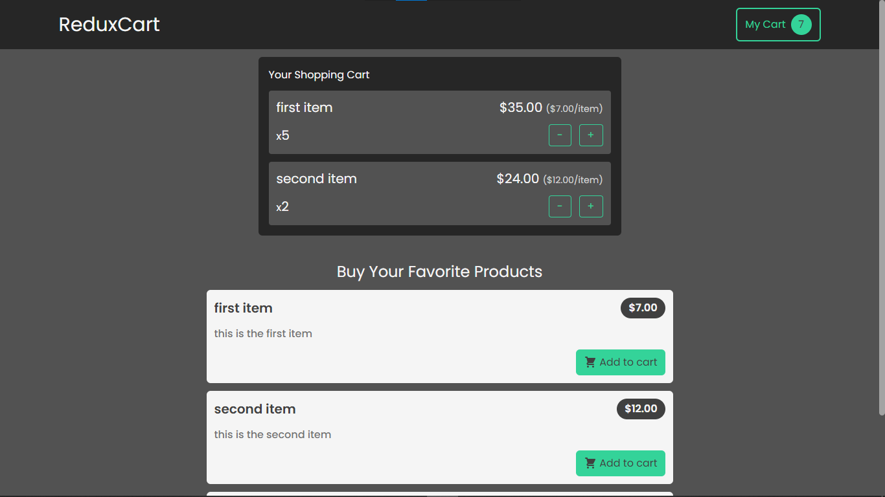

  
  <h1>Redux Cart</h1>
  

    My first small react project which i used redux for state management. in the project you can add products to cart, increase and decrease the amount of them.  
    If the product is already in the cart, the amount and price will be increased but if the product is not already in the cart, it will be added to the cart.  
    If the product's amount that is in the cart become less than 1, it will be removed from the cart.
  

  

    I got the inspiration for this project from Academind react course.
  

  

    Edit the codes and let me know if you have more knowledge or better ideas.
  

  
In the project directory, you can run:

  <pre>npm start</pre>
  

    It runs the app in the development mode. Open
    <a href="http://localhost:3000">http://localhost:3000</a> to view it in the
    browser.
  

  

    The page will reload if you make edits. You will also see any lint errors in
    the console.
  

